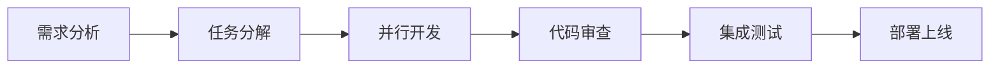

# 🤝 论团队协作的重要性：一个技术废柴的协作踩坑之旅

## 我的"独行侠"时代

曾经的我，是一个彻头彻尾的"独行侠"。

"为什么要团队协作？我一个人就能搞定所有问题！"这是我当时的座右铭。我自认为技术很厉害，不需要别人的帮助，甚至觉得团队协作是浪费时间。

直到那个改变我认知的项目出现。

## 第一次"翻车"：个人英雄主义的终结

### 项目背景：一个看似简单的Web应用

那是一个客户要求的电商网站项目，功能包括用户注册、商品展示、购物车、订单管理等。看起来很简单，我自信满满地接下了这个项目。

**我的计划**：
- 前端：React + TypeScript
- 后端：Node.js + Express
- 数据库：MySQL
- 部署：Docker + AWS

**时间安排**：一个月完成

### 现实给了我当头一棒

**第一周**：前端开发
- 用户界面设计：完成
- 组件开发：完成
- 状态管理：完成

**第二周**：后端开发
- API设计：完成
- 数据库设计：完成
- 业务逻辑：完成

**第三周**：集成测试
- 前后端联调：遇到问题
- 数据一致性：出现bug
- 性能优化：需要调整

**第四周**：部署上线
- 环境配置：遇到问题
- 数据库迁移：出现错误
- 性能测试：不达标

### 问题分析：为什么我一个人搞不定？

**技术层面**：
1. **知识盲区**：我对DevOps、性能优化、安全防护等领域了解有限
2. **时间压力**：一个人要同时处理多个技术栈，时间不够
3. **测试不足**：缺乏全面的测试覆盖，bug频出

**管理层面**：
1. **需求理解偏差**：客户需求理解不准确，导致返工
2. **进度把控困难**：没有外部监督，容易拖延
3. **质量保证不足**：缺乏代码审查，质量参差不齐

**沟通层面**：
1. **客户沟通不畅**：需求变更时沟通效率低
2. **技术决策独断**：没有讨论，容易走弯路
3. **问题解决孤立**：遇到问题时只能自己摸索

## 觉醒时刻：团队协作的价值

### 第二次尝试：加入开源项目

在个人项目"翻车"后，我开始反思。偶然间，我加入了一个开源项目，第一次体验到了真正的团队协作。

**项目背景**：一个AI图像处理工具
**团队规模**：5人（前端2人，后端2人，算法1人）
**协作方式**：GitHub + Slack + 周会

### 团队协作的第一次体验

**代码审查**：
```bash
# 我的第一次PR
git checkout -b feature/image-processing
# 开发功能...
git push origin feature/image-processing
# 创建Pull Request

# 团队反馈
"代码结构很好，但建议添加错误处理"
"这个算法可以优化，我来帮你改进"
"测试用例覆盖不够，需要补充"
```

**知识分享**：
- 算法专家分享了图像处理的最新算法
- 前端大神介绍了React性能优化技巧
- 后端工程师讲解了微服务架构设计

**问题解决**：
- 遇到技术难题时，团队一起讨论解决方案
- 性能问题时，大家一起分析瓶颈
- 部署问题时，DevOps专家提供指导

### 对比分析：个人 vs 团队

| 维度 | 个人开发 | 团队协作 |
|------|----------|----------|
| 开发效率 | 低（需要学习多个领域） | 高（专业分工） |
| 代码质量 | 一般（缺乏审查） | 高（多人审查） |
| 问题解决 | 慢（独自摸索） | 快（集体智慧） |
| 知识获取 | 有限（个人经验） | 丰富（团队分享） |
| 项目风险 | 高（单点故障） | 低（风险分散） |

## 深度反思：团队协作的核心价值

### 价值一：知识互补与技能提升

**我的亲身经历**：
在团队中，我负责前端开发，但通过与后端同事的交流，我学会了：
- API设计的最佳实践
- 数据库查询优化技巧
- 微服务架构设计思路

**技能提升效果**：
- 前端技能：从熟练到精通
- 后端理解：从零到入门
- 架构思维：从局部到全局

### 价值二：效率提升与质量保证

**效率提升**：
- 并行开发：不同模块同时进行
- 专业分工：每个人专注自己的领域
- 工具共享：避免重复造轮子

**质量保证**：
- 代码审查：多人检查，减少bug
- 测试覆盖：不同角度的测试
- 最佳实践：团队积累的经验

### 价值三：创新激发与思维拓展

**创新激发**：
- 头脑风暴：不同想法的碰撞
- 技术选型：多种方案的对比
- 问题解决：不同思路的尝试

**思维拓展**：
- 全局视角：从个人到团队
- 用户思维：从技术到业务
- 长期规划：从短期到长期

## 实践总结：我的团队协作方法论

### 方法论一：有效沟通

**沟通原则**：
1. **主动沟通**：不要等别人来找你
2. **及时反馈**：问题出现时立即反馈
3. **清晰表达**：用简洁明了的语言
4. **倾听理解**：先理解再回应

**沟通工具**：
- 即时沟通：Slack、钉钉
- 视频会议：Zoom、腾讯会议
- 文档协作：Notion、语雀
- 项目管理：Jira、Trello

**我的实践**：
```bash
# 每日站会模板
"昨天完成了什么？"
"今天计划做什么？"
"遇到了什么问题？"
"需要什么帮助？"
```

### 方法论二：任务分解与协作

**任务分解原则**：
1. **明确边界**：每个任务有明确的负责人
2. **合理粒度**：任务大小适中，便于管理
3. **依赖关系**：明确任务间的依赖关系
4. **时间估算**：合理估算完成时间

**协作流程**：


**我的实践**：
- 使用Git分支管理不同功能
- 建立代码审查流程
- 定期进行集成测试
- 自动化部署流程

### 方法论三：冲突处理与团队建设

**冲突处理**：
1. **理性分析**：分析冲突的根本原因
2. **开放讨论**：鼓励不同观点的表达
3. **寻求共识**：找到各方都能接受的方案
4. **及时解决**：避免冲突升级

**团队建设**：
1. **建立信任**：通过合作建立互信关系
2. **知识分享**：定期进行技术分享
3. **团队活动**：组织团建活动
4. **激励机制**：建立合理的激励机制

## 案例分析：成功的团队协作项目

### 案例一：开源AI项目

**项目背景**：
- 目标：开发一个开源的图像识别工具
- 团队：5人（算法2人，前端1人，后端1人，测试1人）
- 时间：3个月

**协作亮点**：
1. **明确分工**：每个人负责自己的专业领域
2. **定期同步**：每周进行进度同步和技术分享
3. **代码审查**：所有代码都要经过审查
4. **自动化测试**：建立完整的测试流程

**项目成果**：
- 按时完成所有功能
- 代码质量高，bug率低
- 获得开源社区认可
- 团队成员技能都有提升

### 案例二：企业内部项目

**项目背景**：
- 目标：重构老旧的业务系统
- 团队：8人（架构师1人，开发6人，测试1人）
- 时间：6个月

**协作挑战**：
1. **技术债务**：老系统技术债务严重
2. **业务复杂**：业务逻辑复杂，理解困难
3. **时间压力**：业务不能中断，需要平滑迁移

**解决方案**：
1. **分阶段重构**：将大项目分解为小阶段
2. **知识传承**：老员工带新员工学习业务
3. **并行开发**：新老系统并行运行
4. **灰度发布**：逐步迁移用户到新系统

**项目成果**：
- 成功完成系统重构
- 系统性能提升300%
- 维护成本降低50%
- 团队协作能力显著提升

## 失败案例分析：团队协作的陷阱

### 案例一：沟通不畅导致的失败

**项目背景**：
- 目标：开发一个移动应用
- 团队：4人（产品1人，开发2人，设计1人）
- 问题：沟通不畅，需求理解偏差

**问题分析**：
1. **需求不明确**：产品经理没有明确表达需求
2. **沟通渠道混乱**：使用多种沟通工具，信息分散
3. **反馈不及时**：问题出现时没有及时反馈
4. **责任不清**：任务分工不明确

**解决方案**：
1. **统一沟通工具**：使用单一沟通平台
2. **明确需求文档**：详细的需求文档和原型
3. **定期同步**：建立固定的同步机制
4. **明确责任**：明确每个人的职责

### 案例二：技术债务导致的失败

**项目背景**：
- 目标：快速开发一个MVP产品
- 团队：3人（全栈开发）
- 问题：为了快速上线，忽略了代码质量

**问题分析**：
1. **代码质量差**：缺乏代码审查和测试
2. **技术债务积累**：快速开发导致技术债务
3. **维护困难**：代码难以理解和维护
4. **扩展性差**：架构设计不合理

**解决方案**：
1. **建立代码规范**：制定统一的代码规范
2. **代码审查流程**：建立代码审查机制
3. **测试覆盖**：提高测试覆盖率
4. **重构计划**：制定技术债务清理计划

## 未来展望：团队协作的发展趋势

### 趋势一：远程协作的普及

**技术发展**：
- 视频会议技术越来越成熟
- 协作工具功能越来越强大
- 云服务让远程协作更加便捷

**我的思考**：
远程协作将成为常态，但面对面交流的价值仍然不可替代。未来的团队协作将是线上线下结合的模式。

### 趋势二：AI辅助协作

**技术发展**：
- AI代码审查工具
- 智能项目管理
- 自动化测试和部署

**我的思考**：
AI将大大提高团队协作的效率，但人类的创造力和判断力仍然是不可替代的。

### 趋势三：跨文化协作

**全球化趋势**：
- 国际化团队越来越多
- 跨时区协作成为常态
- 文化差异需要理解和包容

**我的思考**：
跨文化协作需要更多的理解和包容，但也带来了更丰富的视角和想法。

## 个人成长：从独行侠到团队玩家

### 心态转变

**从"我"到"我们"**：
- 不再追求个人英雄主义
- 学会欣赏团队的力量
- 理解协作的价值

**从"竞争"到"合作"**：
- 不再与同事竞争
- 学会相互帮助
- 追求团队成功

### 技能提升

**沟通技能**：
- 学会清晰表达想法
- 提高倾听和理解能力
- 掌握冲突处理技巧

**协作技能**：
- 学会任务分解和分配
- 提高项目管理能力
- 掌握团队建设方法

### 价值观改变

**从"个人成功"到"团队成功"**：
- 理解个人成功与团队成功的关系
- 学会为团队目标努力
- 享受团队合作的快乐

**从"技术至上"到"以人为本"**：
- 理解技术是工具，人才是核心
- 学会关注人的需求和感受
- 重视团队文化建设

## 总结与反思

### 我的认知转变

**从"不理解"到"离不开"**：
- 初期：认为团队协作是多余的复杂性
- 中期：开始理解团队协作的价值
- 现在：无法想象没有团队协作的开发

**从"独行侠"到"团队玩家"**：
- 初期：追求个人英雄主义
- 中期：开始尝试团队协作
- 现在：享受团队合作的快乐

### 关键收获

1. **团队协作不是可选项，而是必需品**
   - 复杂项目需要团队协作
   - 高质量代码需要多人审查
   - 创新想法需要集体智慧

2. **沟通是团队协作的核心**
   - 有效沟通是成功的基础
   - 及时反馈是质量的保证
   - 开放讨论是创新的源泉

3. **团队协作需要持续学习和改进**
   - 协作技能需要不断练习
   - 团队建设需要持续投入
   - 协作工具需要不断更新

### 给其他"独行侠"的建议

1. **放下个人英雄主义**
   - 承认自己的局限性
   - 学会寻求帮助
   - 享受团队合作的快乐

2. **主动参与团队协作**
   - 加入开源项目
   - 参与技术社区
   - 寻找协作机会

3. **持续学习和改进**
   - 学习沟通技巧
   - 提高协作能力
   - 关注团队建设

## 参考资料

### 团队协作理论
- [《团队协作的五大障碍》](https://book.douban.com/subject/1077958/)
- [《高效能人士的七个习惯》](https://book.douban.com/subject/1048007/)
- [《敏捷软件开发》](https://book.douban.com/subject/1140457/)

### 实践工具
- [GitHub](https://github.com/)：代码协作平台
- [Slack](https://slack.com/)：团队沟通工具
- [Notion](https://www.notion.so/)：文档协作平台
- [Jira](https://www.atlassian.com/software/jira)：项目管理工具

### 学习资源
- [团队协作最佳实践](https://www.atlassian.com/team-playbook)
- [敏捷开发指南](https://www.scrum.org/resources/scrum-guide)
- [代码审查指南](https://google.github.io/eng-practices/review/)

## 结语

从"我一个人就能搞定"到"团队合作真香"，这个过程让我深刻理解了团队协作的价值和意义。

团队协作不仅仅是一种工作方式，更是一种生活态度。它教会了我如何与他人合作，如何倾听和理解，如何在团队中发挥自己的价值。

虽然学习过程中遇到了很多困难，但每一次"翻车"都是成长的机会。现在，团队协作已经成为我工作和生活中不可或缺的一部分。

记住，团队协作不是万能的，但它确实能解决很多个人无法解决的问题。关键是要保持开放的心态，学会与他人合作，在团队中发挥自己的价值。

---

> 💡 **实用小贴士**：当你觉得团队协作很麻烦时，想想一个人处理复杂项目时的痛苦。团队协作虽然需要时间磨合，但一旦形成默契，效率和质量都会大幅提升！

*"在协作的世界里，让技术废柴也能成为团队协作专家！"* 🤝
