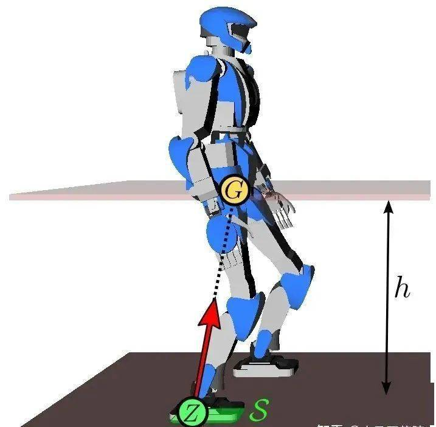
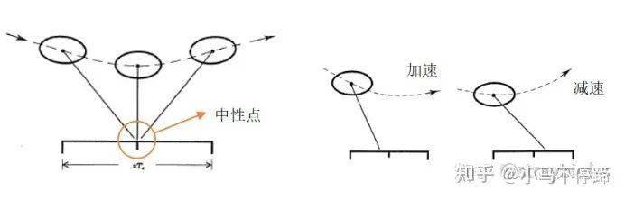
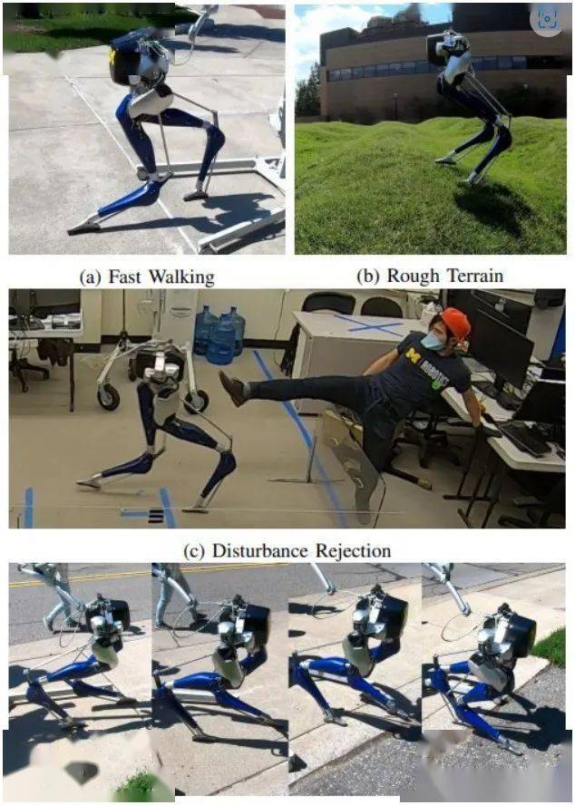
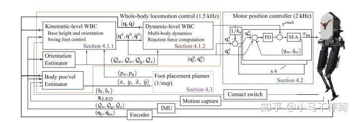
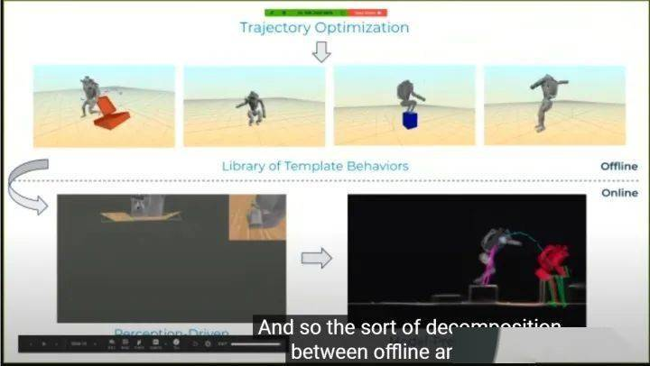
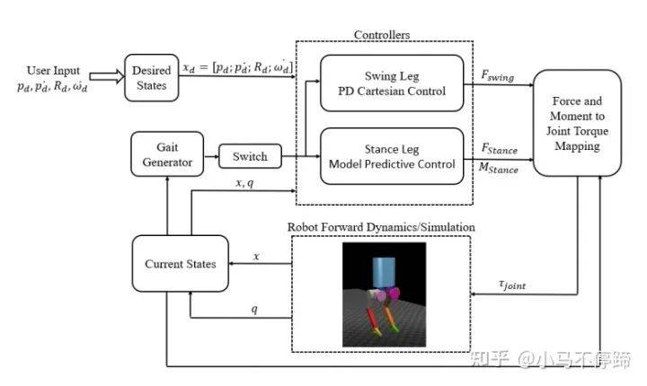
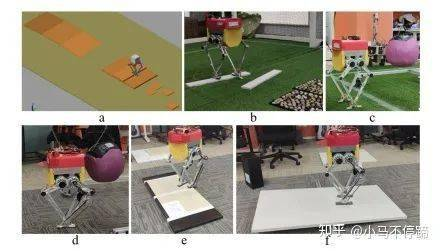

# 具身智能技术随笔《一》：人形机器人控制算法概述

> 本文是具身智能学习笔记栏目的开篇之作，旨在为对机器人控制感兴趣的学习者和小白提供一个清晰的学习路线和认知框架。通过系统梳理人形机器人控制算法的发展历程，帮助读者建立对双足机器人具身智能领域的整体认知。

## 引言：为什么学习具身智能？

具身智能（Embodied Intelligence）是人工智能的一个重要分支，它强调智能体通过与环境的物理交互来学习和适应。在具身智能领域，人形机器人是最具挑战性和代表性的研究方向之一。掌握人形机器人控制算法，不仅能够帮助我们理解智能体如何与物理世界交互，还能为其他具身智能应用（如自动驾驶、无人机控制等）提供理论基础。

本文将从双足机器人控制算法入手，系统梳理从经典控制到现代强化学习的发展历程，为读者提供一个清晰的学习路线图。

## 一、具身智能学习路线图

### 1. 基础知识储备
- **数学基础**：线性代数、微积分、概率论与数理统计
- **物理基础**：经典力学、拉格朗日动力学、刚体运动学
- **编程基础**：Python、C++、ROS（机器人操作系统）

### 2. 机器人控制入门
- **运动学与动力学**：正/逆运动学、雅可比矩阵、动力学方程
- **轨迹规划**：路径规划、时间参数化、轨迹优化
- **基础控制理论**：PID控制、状态空间控制、李雅普诺夫稳定性

### 3. 人形机器人控制进阶
- **简化模型**：倒立摆模型、弹簧负载倒立摆模型
- **平衡控制**：零力矩点（ZMP）控制、角动量控制
- **步态生成**：离线优化、在线规划、混合零动力学

### 4. 现代控制方法
- **全身控制**：任务优先级控制、零空间投影
- **模型预测控制**：在线优化、实时控制
- **强化学习**：策略梯度、值函数方法、模拟到真实迁移

## 二、人形机器人控制算法发展历程

### 1. 双足机器人控制的挑战

双足机器人的控制具有很高的技术难度，尤其是步态控制和平衡问题。因为机器人在移动过程中，外力方面只受到重力和地面的作用力，而重力和地面作用力不能直接控制，只能转而控制机器人关节的驱动力来控制机器人的行走，这样给双足机器人的控制增加了很大难度。

双足机器人依靠在重力和地面作用力行走。

目前对双足机器人步态的研究也经历了几十年，从最初如静步态行走、被动行走等方式发展到如今波士顿动力能灵活的跑酷、炫技。目前双足机器人的步态算法种类繁多，作为近几年刚入双足坑的人，想把一些具有代表性、且成功运用的双足控制算法整理一下，便于以后定位研究领域。

机器人的结构比较复杂，因此，在研究步态算法时，常常对机器人模型做简化处理，最初具有代表性的简化模型就是倒立摆（LIP）和弹簧负载倒立摆（SLIP）。但是这样的模型过于简单，一来没考虑腿的质量，二来将身体简化为质点，也没考虑身体姿态的影响，后来发展出来了centroidal dynamics，以及更复杂得 full-body dynamics，由此也衍生出了不同的控制方法。

### 2. 倒立摆+ZMP模型：经典控制方法的代表

倒立摆（LIP）算法以日本为代表，具有代表性的就是梶田秀司（Shuuji Kajita）所著的《人形机器人》一书，书中详细介绍了LIP+零力矩点（ZMP）在双足机器人步态上的应用。该模型将机器人简化为一个倒立摆模型或小车-桌子模型，整体控制的目的是使实际的zmp位置与参考的zmp位置之间的误差尽可能小，这样机器人在运动过程中才能够稳定。

所以需要根据期望的ZMP位置（期望的落脚点）计算出质心的运动情况和实际的ZMP位置，并且反馈跟踪ZMP位置。一般情况下，使用该控制方法要求机器人行走过程中质心高度是恒定的，因此只能屈膝步行。该控制方法最具代表性的机器人就是本田的Asimo机器人，他可以说当时最先进的机器人，至今也很难被超越，除此之外，还有优必选的Walker，还有德国宇航局的TORO等。

该算法之后又发展出了很多变形，如divergent component of motion（DCM）算法等，Kajita在2018年也提出了基于Spatially Quantized Dynamics（SQD）的算法，能够实现机器人更接近人类的直膝行走步态。

**学习要点**：
- 理解ZMP概念及其在平衡控制中的应用
- 掌握质心轨迹规划方法
- 学习如何将复杂机器人简化为倒立摆模型

### 3. 弹簧负载倒立摆模型（SLIP）：动态平衡的突破

SLIP模型的控制算法首推Marc Raibert在1986写的《Leged Robot that Balance》一书，Raibert是前MIT教授，也是机器人公司波士顿动力的创始人，虽然波士顿动力的算法并未公开，但是有理由相信这本书中的理论占了重要的作用，并且书中提出的控制方法至今仍是很多机器人动态平衡的控制策略。

在这本书中，Raibert将机器人简化成了弹簧倒立摆，并且将其控制浓缩成"三部独立控制法"（Three-Part Control），该方法摒弃了繁琐的理论公式，将弹跳机器人复杂的控制解耦为了三个部分：高度控制、前进速度控制、身体姿态控制。其中落脚点控制是"三部独立控制法"中的关键点。现在许多欠驱动的机器人速度控制仍使用的落脚点调节这种方法。

落脚点速度控制

之后对弹簧倒立摆模型的研究比较多，比较有代表性的是俄勒冈州立大学（OSU）的Jonathan W. Hurst，他是迅捷机器人公司（Agility Robotics）的CTO，著名得Cassie机器人就是出自他们公司，还有Cassie的变体Digit。他们早期在被动脚踝的ATRIAS上研究基于SLIP的动态步态，能够在不平地面上稳定性走。之后他们基于ATRIAS开发出来了著名的鸵鸟腿Cassie以及带上半身的Digit，Cassie出厂使用的算法就是基于弹簧倒立摆。现在他们转向主攻强化学习在双足机器人的应用，并且取得了很大的成果，Cassie已经能跑30分钟的越野，而Digit已经开始商业化。

**学习要点**：
- 理解SLIP模型与LIP模型的区别
- 掌握"三部独立控制法"的核心思想
- 学习如何通过落脚点控制实现动态平衡

### 4. Hybrid Zero Dynamics (HZD)：非线性控制的典范

密歇根大学的Jessy Grizzle主要采用的是Hybrid Zero Dynamics（HZD），该方法在full body dynamics上采用非线性控制理论，将机器人的行走分为单脚支撑阶段和双脚切换阶段，单脚支撑阶段可用Lagrange动力学描述，双脚切换可以看成一个刚体冲击（rigid impact），引起机器人速度突变。

输出方程采用虚约束（Virtual constraint），即选择行走过程中的若干控制变量，将控制变量约束到目标值。采用输入输出线性化，将输出稳定在0。对该系统，用Trajectory Optimization产生最优步态，不同的步态构成Gait Library，行走时，控制器根据机器人状态从Gait Library取步态，然后关节跟踪，因此，该方法本质上还是位置控制，平衡方面采用的一般还是SLIP的foot-placement方法。他们这种方法在MABEL，ATRIAS，Cassie一系列机器人上成功使用。最近，他们提出基于角动量的速度和姿态进行调节方法，对不平地面具有更好的适应性。

另外加州理工大学Amber Lab 的Aaron Ames也主要采用HZD方法来控制机器人行走，甚至移植到了四足机器人上面。另外，他们团队的ayonga 开发了Trajectory Optimization的软件包frost-dev，大大简化了HZD理论的应用，这样机器人的在线控制部分本质上就成为了一个PID+速度姿态调节。

**学习要点**：
- 理解混合系统动力学的基本概念
- 掌握虚约束在步态控制中的应用
- 学习轨迹优化方法及其在步态生成中的作用

### 5. Whole Body Control (WBC)：全身协调控制

另外值得提的是美国德克萨斯大学奥斯汀分校科克雷尔工程学院 Luis Sentis，他是Whole Body Control（WBC）方法的元老级人物，WBC已经成为DARPA挑战赛的通用控制方法。该方法主要思路是将机器人的多任务分优先级，采用零空间投影的方法将低优先级任务投影到高优先级任务零空间，以实现不同任务的层级。

他采用该方法用于双足机器人控制，他们将控制器分为一个基于运动学的WBC模块（KinWBC）和基于动力学的WBC模块（DynWBC），KinWBC模块将机器人行走分为Double stance、Transition和Swing阶段，各个阶段有不同的任务层级，得到期望的关节角度、角速度和角加速度，然后传递给DynWBC模块，优化得到前馈力矩。他们用该方法在被动脚踝机器人Mercury上验证，具有很好的动态稳定性，并且能有效抵抗外界冲击。值得一提的是论文作者DONGHYUN KIM 在MIT时将WBC运用到了Mini Cheetah上，使得速度增大到3.7m/s，也是目前最火的四足开源控制算法。

Mercury控制器架构

此外，因为人形机器人具有冗余自由度，WBC方法最大的用处是在机器人整体操作上，可以产生很好的效果。

**学习要点**：
- 理解任务优先级控制的基本原理
- 掌握零空间投影在多任务控制中的应用
- 学习如何将运动学和动力学控制结合

### 6. Model Predictive Control (MPC)：实时优化的典范

模型预测控制（MPC）最初是用在自动驾驶领域，近几年越来越多地被用到足式机器人上，例如MIT开源的mini cheetah机器人的控制架构就是MPC，只是在MPC计算出足端力的基础上，又用WBC算法计算出关节力矩。另外，波士顿动力的atlas炫酷的跑酷、跳舞动作也是采用MPC实现的，根据团队leader Scott Kuindersma的介绍，他们算法框架分为offline和online两部分，首先根据机器人centroidal dynamics通过offline 优化出一系列Library of Template Behaviors（类似于HZD中的gait labrary），在online部分采用High-speed MPC来跟踪相应的Gait，并做动作的切换，产生作用力、落脚位置、时间等参数。

MPC是一种在线的优化控制算法，可以类似于mini cheetah那样，用于控制机器人的质心位置和姿态，也可跟其他双足机器人控制算法合用，比如用MPC去根据ZMP去规划质心的运动，采用MPC去跟踪HZD产生的Gaitlibrary中的步态及其切换，优必选研究院和清华大学赵明国老师的文章就有这方面研究。

Force-and-moment-based Model Predictive Control for Achieving Highly DynamicLocomotion on Bipedal Robots

Fast Online Planning for Bipedal Locomotion via Centroidal ModelPredictive Gait Synthesis

**学习要点**：
- 理解MPC的基本原理及其在实时控制中的应用
- 掌握如何将离线优化与在线控制结合
- 学习MPC与其他控制方法的融合

### 7. 强化学习：数据驱动的控制新范式

随着机器学习的兴起，强化学习越来越多地被用来控制机器人，机器学习在处理高维度问题方面具天生的优势，而机器人一般维度比较高造成传统的控制方法一般都要做简化处理。强化学习类似于Monte Carlo方法，采用不断的抽样（试错）来得到最优的控制策略。现在常用的是深度强化学习，是将策略用神经网络来代替，得到机器人状态到动作的映射关系。强化学习常用OpenAI Gym环境，仿真环境一般用Mujoco，方法常用Deep Q-learning等，想在真实机器人训练比较难，因此现在都会用sim-to-real。Russ Tedrake早期主攻强化学习在双足机器人上的应用，他是MIT DARPA团队的领队，波士顿动力的Scott Kuindersma之前也是这个团队的。OSU 的Jonathan W. Hurst的团队现在也主攻在Cassie上运用强化学习方法，已经实现了Cassie跳跃、上楼梯等动作。

**学习要点**：
- 理解强化学习的基本原理及其在机器人控制中的应用
- 掌握sim-to-real技术的关键点
- 学习如何将强化学习与传统控制方法结合

## 三、具身智能学习资源推荐

### 1. 入门书籍
- 《Introduction to Humanoid Robotics》- Shuuji Kajita
- 《Legged Robot that Balance》- Marc Raibert
- 《Robotics, Vision and Control》- Peter Corke

### 2. 在线课程
- MIT 6.832 Underactuated Robotics
- Stanford CS223A Introduction to Robotics
- Coursera Robotics Specialization
- https://space.bilibili.com/230105574?spm_id_from=333.337.0.0
### 3. 开源项目
- Drake (MIT)
- ROS (Robot Operating System)
- PyBullet
- Mujoco

### 4. 研究机构与实验室
- MIT CSAIL
- Stanford Robotics Lab
- UC Berkeley Robotics Lab
- CMU Robotics Institute

## 四、学习路线（仅供参考）

### 第一阶段：基础理论
- 学习机器人运动学与动力学
- 掌握基本控制理论
- 熟悉ROS环境

### 第二阶段：简化模型
- 实现倒立摆模型
- 开发ZMP控制器
- 构建SLIP模型

### 第三阶段：高级控制
- 学习HZD方法
- 实现WBC控制器
- 开发MPC算法

### 第四阶段：前沿技术
- 学习强化学习方法
- 实现sim-to-real技术
- 参与开源项目或研究

## 结语

人形机器人控制算法的发展历程，反映了具身智能领域的整体演进趋势：从简化模型到复杂系统，从离线规划到在线优化，从基于模型到数据驱动。通过系统学习这些算法，我们不仅能掌握人形机器人控制的核心技术，还能理解具身智能的基本原理，为未来在更广泛的具身智能应用领域打下坚实基础。

在接下来的具身智能学习笔记系列中，我们将深入探讨各个算法的具体实现细节，分享学习资源和实践经验，帮助读者构建自己的具身智能知识体系。敬请期待！

## 参考文献

《Introduction to Humanoid Robotics》 https://link.springer.com/book/10.1007/978-3-642-54536-8

https://arxiv.org/abs/2008.10763

https://zhuanlan.zhihu.com/p/551382743

## 免责声明

本文部分内容来源于网络公开资料，图片来源于网络。本文仅用于学习和交流，不用于商业用途。如有侵犯您的知识产权，请联系我们删除相关内容。感谢您的理解与支持。